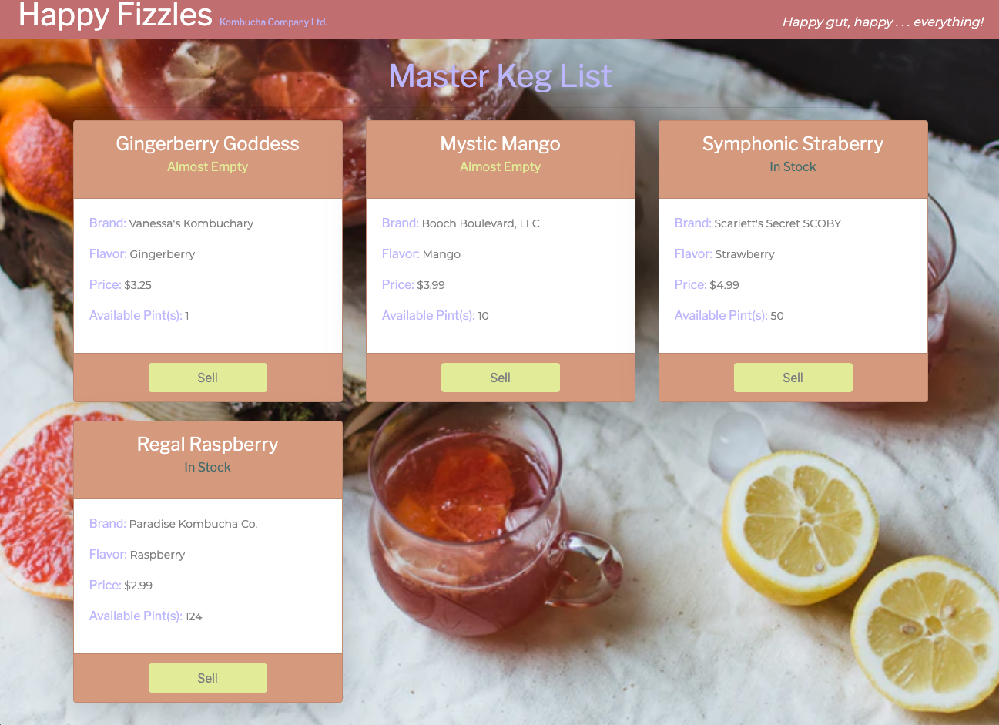

# :tropical_drink: _Kombucha Store with Redux_

_4 December 2020_

#### _Website for a fake kombucha store_

#### By _**Vanessa Stewart**_

## :mag_right: Description

_This is a continuation of an exercise for Epidocodus to practice making a React website with full CRUD functionality. The original instructions were to build a tap room in React where a bar or kombucha store can track their kegs. This project refactors the original project by moving all local and shared state to the redux store._

## :books: User Stories
| #    | Story |
| ---- | ----- |
| 1 | As a user, I want to see a list/menu of all available kegs. For each keg, I want to see its name, brand, price and flavor. |
| 2 | As a user, I want to submit a form to add a new keg to a list. |  
| 3 | As a user, I want to be able to click on a keg to see its detail page. | 
| 4 | As a user, I want to see how many pints are left in a keg. Hint: A full keg has roughly 124 pints. |  
| 5 | As a user, I want to be able to click a button next to a keg whenever I sell a pint of it. This should decrease the number of pints left by 1. Pints should not be able to go below 0.|  
| 6 | As a user, when a keg becomes out of stock, I want to be able to click a button next to the keg to restock it. |  
| 6 | As a user, I want the option to edit a keg's properties after entering them just in case I make a mistake.|  
| 7 | As a user, I want to be able to delete a keg. |  
| 8 | As a user, I want a keg to update with an alert message to say "Out of Stock" once it's empty.|  
| 9 | As a user, I want kegs with less than 10 pints to include an alert message that says "Almost Empty" so I can try a pint before it's gone! |  
| 10 | As a user, I want alert messages (in stock, out of stock, almost empty) color-coded for easy readability. |  
| 11 | As a user, I want this application to be nicely styled. (Use stylesheets and CSS objects!)|  

## :clipboard: Website Planning

## :wrench: Setup/Installation Requirements
* Navigate to the directory in which you would like to clone this project.
* Run `git clone https://github.com/vanmars/kombucha-store-redux.git` in terminal.
* Run `cd kombucha-store-redux` to navigate into new project directory.
* Open the cloned repo in a text editor of your choice.
* Run `npm install` to download all dependencies.
* Run `npm start` to start a live server and view projec in the browser.

## :beetle: Known Bugs
_There are no known bugs at this time. But the following item could be improved:_

## :mailbox_with_no_mail: Support and Contact Details
_Connect with me at vamariestewart@gmail.com with ideas to improve this project._

## :computer: Technologies Used
* HTML
* CSS/Bootstrap
* JavaScript/JSX/React/Redux
* Webpack
* NPM

## :camera: Photo Credits
Background Image Photo by <a href="https://unsplash.com/@curryandlove?utm_source=unsplash&amp;utm_medium=referral&amp;utm_content=creditCopyText">Klara Avsenik</a> on <a href="https://unsplash.com/s/photos/kombucha?utm_source=unsplash&amp;utm_medium=referral&amp;utm_content=creditCopyText">Unsplash</a>

### License

Copyright (c) 2020 **_Vanessa Stewart_** 

Permission is hereby granted, free of charge, to any person obtaining a copy of this software and associated documentation files (the "Software"), to deal in the Software without restriction, including without limitation the rights to use, copy, modify, merge, publish, distribute, sublicense, and/or sell copies of the Software, and to permit persons to whom the Software is furnished to do so, subject to the following conditions:

The above copyright notice and this permission notice shall be included in all copies or substantial portions of the Software.

THE SOFTWARE IS PROVIDED "AS IS", WITHOUT WARRANTY OF ANY KIND, EXPRESS OR IMPLIED, INCLUDING BUT NOT LIMITED TO THE WARRANTIES OF MERCHANTABILITY, FITNESS FOR A PARTICULAR PURPOSE AND NONINFRINGEMENT. IN NO EVENT SHALL THE AUTHORS OR COPYRIGHT HOLDERS BE LIABLE FOR ANY CLAIM, DAMAGES OR OTHER LIABILITY, WHETHER IN AN ACTION OF CONTRACT, TORT OR OTHERWISE, ARISING FROM, OUT OF OR IN CONNECTION WITH THE SOFTWARE OR THE USE OR OTHER DEALINGS IN THE SOFTWARE.